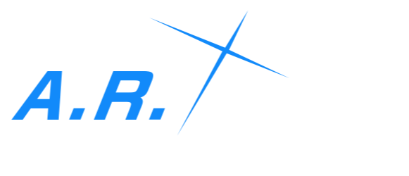

<p align="center">
  
</p>

# A.R.O.N.A

## Overview

A.R.O.N.A is an open-source AI project based on Tiny Llama, specifically designed for Blue Archive Linux. The AI, Arona, serves as an interactive assistant with customizable training capabilities.

### Basic Usage

- **Test AI**: Run `python3 chatbot.py` to interact with Arona.
- **Chat Interface**: Run `python3 main.py` for a full chat experience.
- **System Compatibility**: Works on Linux, Windows, MacOS, Android or even IOS

## Build

### Prerequisites

- Python 3
- CUDA-compatible GPU (recommended)
- Google Colab (recommended for training)
- Nvidia T4 GPU (optimal for training)

### Installation

```bash
pip install --upgrade pip
pip install torch transformers peft accelerate bitsandbytes datasets
```

### Build Methods

#### 1. Train Locally

Run the following command on your machine:

```bash
python3 trainbot.py
```

#### 2. Train with GitHub Actions

1. Fork this repository.
2. Edit the configurations as needed.
3. Start the GitHub Action called `trainbot`.
   - Free-tier GitHub Actions should take around **4 hours** to complete training (500 dataset).

#### 3. Train on Google Colab

1. Open `trainbot_colab.py`.
2. Copy the script and run it in a Colab notebook.
3. **Important**: Ensure you select an **Nvidia T4 runtime** for optimal performance.
   - Training on Google Colab should take around **30 minutes** (500 dataset).

## Recommended Hardware

- CUDA-compatible GPU
- Nvidia T4 (optimal for training)
- Google Colab Pro recommended

## Training Tips

- Use Google Colab for best performance.
- Ensure sufficient GPU memory.
- Regularly save model checkpoints.

## License

[Specify your license here]

## Contributors

[List contributor information]

## Acknowledgments

- TinyLlama Project
- Hugging Face Transformers

